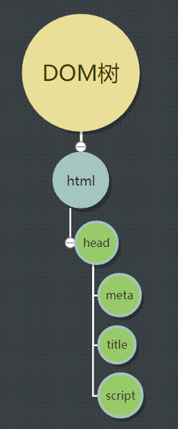
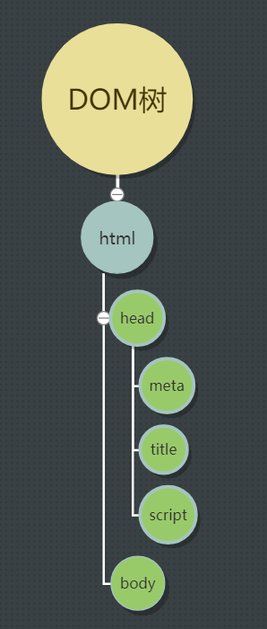
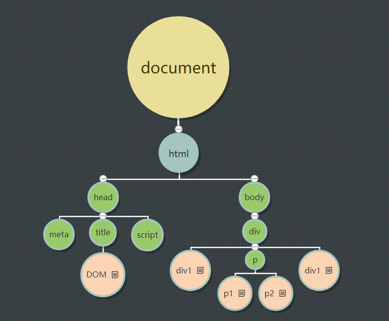
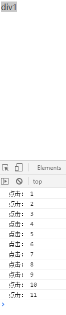

# JavaScript 的基础

- 编程的基础语法；
- 函数及作用域；
- 对象的概念；
- 浏览器原理和BOM；
- DOM操作；
- 事件的原理。

# 第一个JS命令：alert() 弹窗

```
alert("这是什么大宝贝！");
```

数字可以不用引号：
```
alert(123);
```

## document.write()

弹窗在页面上面，和页面本身没关系。而`document.write()`会写内容到页面上。

## console.log() 

将内容写到控制台。可以用来调试代码，藏一些提供给编程人员看的信息。

# 变量

## 定义变量的方法

创建一个空的变量（容器）。

```
var x;
```

## 变量的赋值 | Assignment

```
var x = 1;
```

### 值的种类

- 数字
  ```
  var x = 1;
  ```
- 字符串（用引号包围）
  ```
  var y = "朱一龙"
  ```
- 布林/布尔值
  ```
  var z = true
  ```

- 字典/映射/哈希
  ```
  var t = { color: "red" }
  ```
## 变量可以给其它变量赋值

# 运算符

## 赋值（等号）运算符

把右边的值赋值给左边的变量。

## 加减乘除

## 取模运算符 %

4 / 2 = 2  
5 /2 = 2 * 2 + 1 -> 1  
5 % 2 = 1

```
var x;
x = 5 % 2;
```
级别和乘除同级。

## 特殊的加号

字符串的加号可以实现字符串的拼接，比如：
```
var x = "abc";
var abc = "def";
var def = "ghi";
var alphabet = x + abc + def 
document.write(alphabet)
```

结果就是：
```
abcdefghi
```
注意：字符串只能用加号来做运算，不能使用其他运算法。

如果是字符串加上数字，会将数字视作字符串，得到`字符串 数字`的结果（中间有空格）。
比如：
```
var x = "abc";
var y = "abc" + 1;
document.write(y)
```
出来的结果会是“`abc 1`”

## 自增1 `++`

- `++a`：先自增
- `a++`：后自增

后自增，是说先做别的，再做自增，所以顺序是 var a = 1 > var b = a + 5 =6 > 最后做自增 a = a + 1，所以等于2
```
var a = 1;
var b = a++ + 5;
```

### 一元运算符和二元运算符

- `a++`这种就是一元运算符，只操作一个元素；
- `a + b` 二元运算符

一元运算符优先级高于二元运算符。


# if 判断语句

```
var money = 101;
if (money > 100); {
document.write("环游世界");
document.write("换个老公");
}
```
## 条件的种类

- 等于，==
- 小于，<
- 大于，>
- 不等于，!=
- 大于等于，>=
- 小于等于，<=

## 条件的叠加

### `&&`表示并且：
```
var money = 100;
if (money >= 100 && age <= 30) {
document.write("环游世界");
document.write("换个老公");
}
```

### `||`表示或者：
```
var money = 100;
age = 31;
if (money >= 100 || age <= 30) {
document.write("环游世界");
}
```

### 多个if语句

各自独立执行自身的逻辑：
```
var money = 201;
if (money > 100) {
    document.write("环游世界");
}
if (money > 200) {
    document.write("置换房子");
```

### if...else...

```
var money = 99;
if (money > 100) {
document.write("吃两顿大餐");

}else {
document.write("吃一顿大餐");
        }
```

### if...else if...else

```
var money = 61;
if (money > 100) {
document.write("吃两顿大餐");

}else if (money > 50) {
document.write("吃一顿大餐");

}else {
document.write("叫个外卖");
}
```

## True 和 False

在做if判断的时候，程序会判断给到的值是否符合条件（true/false），进而执行结果，相当于：
```
var b = true;
if (b) {
    document.write("Truth");
}
```

## 用 if 判断 + prompt(,)来做一个弹窗小游戏

```
var x = prompt("你比较喜欢湖人还是快船？", "湖人");
if (x == "湖人") {
    document.write("这么巧，我老公也最喜欢" + x );
} else if (x == "快船") {
    document.write( x  + "的确也还不错啦！");
} else document.write("我对" + x + "一般般啦！");
```

# if 的表妹：三元运算符

下面这种运算中，是对两个元素进行运算：
```
var x = 1 + 2;
```
当然，元素的范畴很广，也可以是下面这种情况：
```
var x = a + b;
```
那么以此类推，三元运算符是对三个元素的运算，通常会用下面的形式来表达：
```
var y = criteria ? Result_A : Result_B
```
注意其中的符号：
- 等号“=”：左边是定义变量的名称，最紧邻右边的是条件式；
- 问号“？”：问号表示对条件式的提问，？左边的条件有没有符合？
- 冒号“：”：如果成立，将冒号左边的结果赋值给变量，否则将冒号右边的结果赋值给变量。

让我们用公允地来决定谁来做家务！
```
var daysperweek = 7;
        var worker = daysperweek > 7 ? "汤晓莉" : "金长龙";
        document.write("今天谁来拖地，当然是" + worker);
```

# 数据类型和转换

js是一种弱类型的语言。所谓弱类型，是指你定义变量的时候，并不知道它是什么类型。  
相对的，强类型（比如C++）里，`int a = 1`，定义的时候已经给出了数据类型。  

 数据类型：  
- 原始类型：数字 Number、字符串 String、布尔值 Boolean、undefined。
- 对象 Object：把原始值进行多重组合。还有一个特殊的对象，`var a = null`，表示这是一个空的对象。
  - 系统自带的对象：数组、函数
  - 自定义 {}

## 数组

把原始类型数据按顺序排列好。
比如说，有三门课，考了60 61 62分。（把原始类型用逗号隔开）
```
var a = [60,61,62];
```
利用“下标”来访问数组里的值
```
a [0]
```
用自增的方式去访问数值，所以`a[0]`就是60 `a[1]`就是61 `a[2]`就是62。  
数组里面可以是任何类型的数据，包括字符串、布林值和对象。
```
var a = [0,"string",false]
```

## 自定义对象

```
var a1 = 60;
var a2 = 61;
var a3 = 62;
```
可以写成自定义对象的形式：
```
var a = {"a1":60, "a2":61, "a3":62}
```
这种情况需要这样访问：`a.a1` 就是60，以此类推。

```
var a = {0:60, 1:61, 2:62};
```
上面的情况怎么访问呢？和数组一样，用下标，`a[0]`。所以，数组其实是对象的一种简写。

## 查看对象类型

`typeof()`

## 数据的转换

字符串可以转换成数字，可以用`Number()`，比如
```
var a = "1111"
undefined
var b = Number(a);
undefined
b
1111
typeof(b)
"number"
```

数字转换为字符串：
```
a = 1
1
b = String(a);
"1"
typeof(b)
"string"
```

# 流程控制 Control Flow

- 条件判断 if
- 选择 switch
- 循环： for / while 循环

## if 
if (表达式/条件为真) 
{
    语句
}

```
var score = 79;
if (score >= 90) {
    console.log("奖励小猪佩奇");
}
else if (score >= 80){
    console.log("好好做暑假作业")
}
else {
    console.log("暑假上补习班");
}
```

## switch

`break` 跳转语句  
switch(表达式的值)  
```
{
    case 1: //如果值是1
        a = 1;
        b++;
        break; //跳出
    case 2: // 如果值是2
        a = 2 
        break;
    default: //如果值不是给出的任何一种，执行默认的结果
        a++;
        break;
}
```

```
var day = 2;
switch(day)
{
    case 1:
        console.log("星期一");
        break;
    case 2:
        console.log("星期二");
        break;
    case 3:
        console.log("星期三");
        break;
    default:
        console.log("放假，别上班了！")
        break;
}
```
如果 `day = 1`，而恰巧`case 1`后面没有加上`break`会怎么样呢？console log中会显示星期一和星期二。

## 循环

重复多次做一件事情。  


### for 循环

说10遍“我要100块”。  

```
for(var a = 1; a <= 10; a++)
{
    console.log(a + "我要100块钱！")
}
```

也可以将初始化`var a = 1`放到最上面，记得仍然要保留`for()`中的分号：
```
var a = 1;
for(; a <= 10; a = a + 1)
{
    console.log(a + "我要100块钱！")
}
```
也可以这么写：
```
var a = 1;
        for(; a <= 10; )
        {
            console.log(a + "我要100块钱！");
            a = a + 1;
        }
```
但是这两种写法就体现不出for循环写法的简便了。

### while 循环

```
var a = 1;
while(a <= 10)
{
    console.log(a + "我要500块钱！")
    a = a + 1;
}
```

和break一起使用:  
```
var a = 1;
while( true )
{
    console.log(a + "我要999块钱！");
    a = a + 1;
    if( a > 10)
    {
        break;
    }
}
var end;
```

和continue一起用:  
```
var a = 1;
while( true )
{
    console.log(a + "我要888块钱！");
    a = a + 1;
    if(a <= 10){
        continue;
    }
    break;
}
var end;
```

#### do...while...

先执行，再看条件决定要不要循环：  
```
var a = 1;
do {
    console.log(a + "我要777块钱！");
    a = a + 1;
}while(a <= 10);
```

# 函数及作用域

## 函数是什么？

为了实现代码的复用 (reuse)。把特定功能的语句打包放在一起。
- 形参
- 实参

## 函数的语法

```
function name (0~N个parameters){
    执行的语句
}
```
```
function chant() {
            for( var a = 1; a <= 10; a++){
            console.log(a + "好好学习，天天向上！");
            }
        }
        
        var time = 7;
        chant();

        var time = 12;
        chant();

        var time = 23;
        chant();
```

### 还可以中间更改函数名：

```
function chant() {
for( var a = 1; a <= 10; a++){
console.log(a + "好好学习，多买代言！");
}
}

var time = 7;
chant();

var change = chant;
change();
```

### 加入参数

定义参数后，可以通过参数控制循环的次数：  
```
//喊口号，喊num次。
function chant(num) {//这里是形参
    for( var a = 1; a <= num; a++){
    console.log(a + "好好学习，多买代言！");
    }
}

var time = 7;
//这里定义5次
chant(5); //这里是实参

var time = 7;
//这里定义8次
chant(8);
```

多个参数用逗号隔开。
```
function chant(num,time) {
    for( var a = 1; a <= num; a++){
    console.log(time + "点" + a + "好好学习，多买代言！");
    }
}

var time = 7;
chant(5,time);

var time = 12;
chant(8,time);
```

## 返回值 return

```
function add(x, y) { //函数的定义
    return x + y;
}

var rs = add(1, 2);
console.log("1+2 = " + rs); //函数的调用

var rs = add(3, 4);
console.log("3+4 = " + rs);

```
## 设置参数的默认值

在上面的例子中，可以看到定义函数里，有两个形参。如果后面的实参中其中一个没有指定，就会出现`undefined`。为了解决这个问题，可以为那个实参指定默认值。这样一来，如果是实参，就可以直接传入它，如果没有，就传入设定好的默认值，设定的方法是：
```
time = time || 8;
```
写成代码，就是下面的意思：
```
if(time == undefined)
time = 7;
```
上面的例子中，`||`为或者的意思，左边是说如果指定了参数，那么就是指定的值，否则就使用默认值7。具体应用到上面的例子中，是这样的：
```
function chant(num,time) {
    time = time || 8;
    for (var a = 1; a <= num; a++) {
        console.log(time + "点" + a + "好好学习，多买代言！");
    }
}
var time = 8;
chant (10);
```
## 动态参数

参数可以看做一组叫做“arguments”的数组，
```
var arguments -> [1,2,3,4,5];
x = argument[0];
y = argument[1];
...
```
具体的长度可以写成`argument.lenth`，从数组中取值写成变量就是`argument[i]`。`a+=b`也可以写成`a=a+b`。所以可以看到下面这样写了后，就能一直累加数组里的值，这就是动态参数。
```
function add() {
    var z = 0;
    for(var i = 0; i < arguments.length; i++){
        z += arguments[i];
    }
    return z;
}

var rs = add(1,2,3,4,5);
console.log(rs);
```

# 作用域

可访问变量的集合（包括对象和函数）。定义了一个变量，该变量可以被使用的地方，以及可以使用的范围。

在JS中，以函数来划分，作用域分为：
- 全局作用局，也叫做全局变量，在函数外定义的变量，在所有地方都能被访问到
- 局部作用域，也叫做局部变量，在函数内定义的变量，只能在定义变量的函数里面被访问到

全局变量和局部变量的名称冲突时，会互不影响。

在js中有一个特例，如果在函数中写了`y=100`，它会直接将y变成一个全局变量。
```
function add(){
    y = 100;
}
```

## 预解析

浏览器获得js文件的时候，不会立刻去执行代码，首先会全篇快速扫描一遍，将变量进行预解析。预解析会将变量的声明提前。函数体中的局部变量也会进行预解析。

***听是听懂了，不过不知道干嘛用***

# 闭包

为了解决变量的私有化问题。

### 全局变量和局部变量的的生命周期

只要页面不关闭，全局变量就会一直处于活跃的状态。  
而局部变量只局限于函数中，函数的大括号一结束，又重新回归到最初状态。

全局变量虽然可以让变量一直处于活跃的状态，但是因为所有人都能访问它、修改它，因此造成了它的不稳定性。这时候，就需要闭包介入到其中，完成私有化的操作。
```
function add(){
    var counter = 0;
    
    plus = function (){ //调用这个plus：
        counter++; // 没有加var，变成全局变量了，这样它就有全局变量的生命周期了
        console.log("counter = " + counter);
    }
}

add(); //counter的初始化

plus();

plus();

plus();
```

简写：
```
function add(){
    var counter = 0;
    
    var plus = function(){ //调用这个plus：
        counter++; 
        console.log("counter = " + counter);
    }
    return plus;
}

var plus = add(); //counter的初始化

plus();

plus();

plus();
```

继续简写：
```
function add(){
    var counter = 0;
    
    return function(){ 
        counter++; 
        console.log("counter = " + counter);
    }
}

var plus = add(); //counter的初始化

plus();

plus();

plus();
```

```
var plus = (function(){
    var counter = 0;
    
    return function(){ //调用这个plus：
        counter++; // 没有加var，变成全局变量了，这样它就有全局变量的生命周期了
        console.log("counter = " + counter);
    }
})();

plus();

plus();

plus();
```

# 对象的概念

函数：一堆语句的集合
对象：一堆变量和一堆函数的集合。
```
var obj1 = {
    x: 0,
    y: 1,
    z: function(){console.log("z fuc");},
    "first name": tang,
}
```
`x: 0,`整个一条叫做属性，格式是`名称: 值,`。属性名称的类型术语字符串，理论上应该写成`"x": 0,`，纯数字字母（不能以数字开始）的属性名称可以不加引号；如果包含了特殊字符，比如空格、连字符等，必须加上引号。比如`"first name": tang,`
对象的直接量

## 万物皆对象

直接量的书写方式：
```
 var person1 = {
    name: "xiaoming",
    sex: "male",
    age: "18",
    slogan: function() {
        for(var i = 0; i < 10; i++){
            console.log("who am i")
        }
    }
}
```
可以用类对写法进行优化，后面会介绍。  
类也分系统自带和自定义的。

## 对象中属性的基本操作

比如人的年龄，每年都会增加。对象的基本操作包括：增删改查。
- 增加
- 删除
- 修改属性的值
- 查：获取属性的值
- 遍历：把所有的属性逐一过一遍。

### 查

查很简单，以上面的例子为例：
- `person1.name`就能获取`xiaoming`
- `person1["name"]`
- 和变量结合使用`var name = person1.name`或者`var name = person1["age"]`。

注意：
如果属性名称本身包含特殊字符，必须用引号表示，那就不能用`.`的形式，比如如果人的属性里有`"first-name"`，那就不能用`person1.first-name`这种方式来获取属性值。

### 改

- `person1["name"] = "xiaoming2"`  
- `person1.name = "xiaoming2"`

### 增加

修改属性的时候，如果对象里面没有这条属性，就会自动增加。

- `person1.height = 170;`

### 删除

使用`delete`

`delete person1.name;`

如果一个对象里包含了对象。当使用`delete`语句后，只会断绝两者的关系，而不会删除信息。  


### 遍历

`for( var pN in person1 )`  

```
for(pN in person1){
    console.log("person1的属性名：" + pN);
}
```

甚至能列出所有的值：
```
for(pN in person1){
    console.log("person1的属性名：" + pN + "值：" + person1[pN]);
}
```

### 对象的引用和赋值

var 是一种很小的容器，只能容纳数字、字符串、布尔值等。对象对于它来说太庞大了。所以，如果想要放对象，需要将对象打包起来，然后给予它一个简单的值，作为标签，进而去获取相关信息。

`var person2 = person1;` 这个动作就好比去打开001的包裹；让person2引用001的内容。既然是引用，所以也难怪修改`person2.name`的值的时候，会出现`person1.name`也一起修改的状况。

```
person1 = {
            name: "xiaoming",
            sex: "male",
            age: "18",
            slogan: function () {
                for (var i = 0; i < 10; i++) {
                    console.log("who am i");
                }
            }
        }

        // var 是一种很小的容器，只能容纳数字、字符串、布尔值等。对象对于它来说太庞大了。所以，如果想要放对象，需要将对象打包起来，然后给予它一个简单的值，作为标签，进而去获取相关信息。
        var person1 = 001; 
        var person2 = person1; //去打开001的包裹；它引用了001的内容
        person2.name = "xiaochu" //既然是引用，当然会将person1和person2都改了。
```

```
function PersonClass() {
            this.name = "xiaoming";
            this.sex = "male";
            this.age = "18";
            this.slogan = function() {
                for(var i = 0; i < 10; i++){
                    console.log("who am i");
                }
            } 
        }
        var person1 = new PersonClass();
        var person2 = new PersonClass();
        person2.name = "xiaochu"
```

也可以通过传参数的方式通过了建立对象，这样就不需要再一个个修改属性的值了
```
function PersonClass(pName, pSex, pAge) {
    this.name = pName;
    this.sex = pSex;
    this.age = pAge;
    this.slogan = function() {
        for(var i = 0; i < 10; i++){
            console.log("who am i");
        }
    } 
}

var person1 = new PersonClass("xiaoming", "Male", "18");

var person2 = new PersonClass("xiaochu", "Female", "15");
```

甚至，还能设置默认参数值：
```
function PersonClass(pName, pSex, pAge) {
    this.name = pName || "xiaoming";
    this.sex = pSex || "Male";
    this.age = pAge || "18";
    this.slogan = function() {
        for(var i = 0; i < 10; i++){
        console.log("wo shi: " + this.name);
        }
    } 
}

var person1 = new PersonClass();

var person2 = new PersonClass("xiaochu", "Female", "15");
```

可以发现，构造函数的方式几乎都能用到类的创建中。但是需要注意的是，如果需要引用一个变量，必须用`this.attribute`的格式，比如：`console.log("wo shi: " + this.name);`

#### 命名空间用类来写

用对象来表示命名空间：

```
var abc = {

}
```

以后就用对象的形式`abc.Age = 100;`

#### 系统提供的类

var obj1 = {};
var obj2 = new Object(); // 都是得到一个空的对象

万物皆对象，无论值还是方法。互相之间还能转换。
比如下面把数字转成字符串：
```
var n1 = 123;
var str1 = no1.toString();
```

可以前往[这里](http://www.w3school.com.cn/jsref/jsref_obj_math.asp)，查看更多的转换。下面的这段代码是为了看，执行一亿次a++，浏览器需要多少耗时：
```
var time1 = new Date(); //获取本地电脑的时间
    var t = 0;
    for(var i = 0; i < 100000000; i++){
        t++;
    }

    var time2 = new Date();
    var n = time2.getTime() - time1.getTime();
```

#### 数学相关的对象

math有点类似于命名空间。  
取随机数：
```
for(var i = 0; i < 10; i++){
    console.log(Math.floor(Math.random() * 10 ));
}
```

# 浏览器原理和BOM

BOM = Browser Object Mode，浏览器对象模式

- 浏览器原理
- JS时间线
- 弹窗
- 获取导航栏的数据
- 网页前进后退、屏幕大小
- 计时器

## 浏览器如何加载页面

浏览器有点像简单的操作系统。  

1. 输入一个网址，比如`www.baidu.com`
2. 把网址转换为IP地址：为了定位服务器，需要IP地址。比如`10.10.10.10`，有了IP地址，就能找到服务器。而网址是**域名**，域名是为了好记。具体的流程是：
   1. 浏览器把`www.baidu.com`发送给DNS服务器；
   2. 服务器返回给浏览器对应的IP地址；
3. 浏览器接受到IP地址，并将地址**缓存到本地**。这样下次就能直接拿到IP地址了。
4. 浏览器开始向`www.baidu.com`请求
   - 怎么理解HTTP/HTTPS协议？  
     浏览器前往服务器需要一种“交通方式”，而HTTP/HTTPS等传输协议就是这种方式。
5. 服务器收到了一个请求。
   - **端口**是什么？  
     可以把服务器比作一座办公大楼，大楼里有很多窗口（1~65536）。
     请求网页默认从80端口请求。如果是别的端口，就要在地址中注明。
6. 服务器将请求的内容处理一下返回给浏览器。
7. 浏览器收到内容，将内容进行解析。
8. 呈现页面给用户。

## 浏览器的多线程

- 做JS解析的线程
- UI渲染线程
- 事件触发的线程
- 发起请求的线程
- 定时器的线程

## 处理js时，是单线程的

仍然做个比喻，银行里面只有一个柜台去处理和js相关的事情。所以处理js事情时，会有队列。之所以执行单线程，是为了方便编程。

单线程引起了两个概念：
- 同步任务
- 异步任务

用存钱做例子。  
- 同步任务中，我到了窗口开始填单子，回答问题，后面的人只能排队；
- 异步任务中，我先把单子填好，再去排队，把钱给柜台就结束。

## js怎么在浏览器生效

### 第一阶段：载入阶段（JS的时间线）

默认情况下，是同步的。  
1. 浏览器获取页面内容，比如`2.html`，开始进行解析。
2. 生成DOM树。
   
3. 遇到`script`时，将暂停生成DOM树。转而开始同步，也就是将js脚本下载下来，并用js解析器对脚本作解析并执行。
4. 继续DOM树。  
   
5. 解析完成。
6. 进行渲染。同时，还有文件正在下载，比如图片等。
7. 载入阶段结束，页面完全加载。

这种流程中，由于DOM树的生成过程可能会被js同步中断，因此无法获取节点的情况的发生。比如下面：
HTML:
```
<head>
    <meta charset="UTF-8">
    <meta name="viewport" content="width=device-width, initial-scale=1.0">
    <meta http-equiv="X-UA-Compatible" content="ie=edge">
    <title>客户端</title>
    <script src="dom.js"></script>
</head>
<body>
    <div id="div1">aaaa</div>
    <div id="div2">bbbb</div>
</body>
```
运行到`script`后，开始同步脚本。脚本：
```
var n = document.getElementById("div1");
console.log(n);
n = document.getElementById("div2");
console.log(n);
```
运行脚本的时候，还没有在DOM树中生成`div1`, `div2`两个节点，所以会在控制台中看到null。

为了解决这种问题，现在有两种做法：
- 是将`script`放到后面，延迟加载；
- 异步加载。

### 第二阶段：事件阶段

默认情况下，是异步的。

### 第三阶段：

# DOM

## DOM树

需要将内容转换成浏览器能够看懂的数据结构，方便查找、修改、遍历和操作。DOM就是这样一种树形的数据结构。  




- document节点：只有一个
- 标签节点/元素节点：样式要找到标签节点来修改
- 文本节点：

### 找到节点的方法

三种最常用的方法：
- 通过ID来查找
- 通过标签名来查找
- 通过`CSS class`来查找

### 数据结构

- 线性 Linear
  - 单链表
  - 循环链表
  - 队列
  - 栈
  - 数组
- 树状 Tree-structure，根据算法进行命名
  - 二叉树；
  - 平衡树；
  - 红黑树；
- 网状 Nesting
  - 有向图
  - 无向图
  - 寻路算法

#### 通过`id`来查找

`id`具有唯一性。  
`document.getElementById("")`

```
var div1 = document.getElementById("div1");
```
但是，有时候会出现`null`的值。这是因为js时间线的关系。在前面的章节，学习到过浏览器在解析内容的时候，如果碰到了`script`标签，就会暂停DOM树的解析，转而去提取脚本信息。因此，遇到这种问题的时候，只要将`script`移动到`body`的闭合标签前面就可以了。


#### 通过标签名来查找

`document.getElementsByTagName("");`

标签名是多个的，所以是Elements。得到的会是一个数组。
```
var ps = document.getElementsByTagName("p");
```

#### 通过class来获取节点

`document.getElementsByClassName("");`  
通过class来获取节点，无论节点有多少个class，都能找到。

### 三种方法的区别

- 通过id获取到的直接就是一个节点。
- 通过标签和Class获取到的是一个数组。即使只获得了一个节点，也仍然是一个数组。通过从数组提取具体的节点。
- 通过id获取，只能通过document对象来使用。而Tag和Class，可以在任意标签节点上使用。

#### 就第二点的具体说明

HTML  
```
<div id="div1" class="box1 txt1">
    div1
    <p class="txt txt1">p1</p>
    <p class="txt">p2</p>
</div>
```
JS  
```
var div1 = document.getElementById("div1");
//在标签节点下通过Class查找节点
var ps = div1.getElementsByClassName("txt1");
```
可以看到：
- 通过标签或Class查找可以在节点下进行，而通过id查找节点只能在document对象下进行。
- 在节点下查找的话，不包括当前节点，而只能查找该节点以下的节点。

### 创建节点和添加节点到DOM树

1. 获取想要创建的节点的父节点
   ```
   var div1 = document.getElementById("div1");
   ```
2. 创建新节点
   ```
   var p = document.createElement("p");
   ```
   到这一步，只是将一个叫做"p"的元素创建到了document中。接着，就要将它加入到DOM树中的指定位置中。
3. 添加节点到DOM树中的指定节点位置
   ```
   div1.appendChild(p);
   ```
   现在，已经将`p`标签创建到DOM树的指定位置了。现在试着插入一个文本节点。比方说，为刚才创建的`p`标签加入文字节点。
4. 创建文字节点
   ```
   var p1txt = document.createTextNode("我是一个段落");
   ```
5. 将文字节点加入到DOM树的指定位置：
   ```
   p.appendChild(p1txt);
   ```

### 删除节点

删除节点`removeChild()`，是指从当前节点删除子节点。以下面作为例子进行：  
HTML
```
<body>
    <div id="div1">
        <div id="div2">div2</div>
    </div>
    <script src="dom.js"></script>
</body>
```
现在，就试着从上面的这段HTML代码中删除`div2`这个节点。根据`removeChild`的定义，我们需要这么做：  
1. 找到div2的父节点，也就是div1。
   ```
   var div1 = document.getElementById("div1");
   ```
2. 现在，就能删除了：
   ```
   div1.removeChild(div2);
   ```

上面这种方法可行。但是太麻烦了。能不能直接找到div2，然后将它删除呢？

直接用div2.parentNode来取代div1
```
div2.parentNode.removeChild(div2);
```

### 对节点的属性和内容进行操作

1. 一样的，先要获取要操作的属性的节点。
   ```
   var img1 = document.getElementById("img1");
   ```
2. 然后，就能修改这个节点上的属性了。
   ```
   img1.src = "dom_tree_example.png";
   ```

#### 两个特例

##### 修改class属性

因为class在js里面是类的关键词，所以不能直接使用，强制要求改成`className`，比如，有这么一段`html`代码：``。现在要通过js脚本将`class`改成`box1`。
1. 仍然找到这个节点。
   ```
   var img1 = document.getElementById("img1");
   ```
2. 注意，修改属性的时候，不要直接用class这个名字，需要改成className：
   ```
   img1.className = "box1";
   ```

##### CSS样式的修改

CSS是一种层叠属性，可以通过`.`来解决这个问题，比如`img1.style.color = "100px";`

```
img1.style.width = "30px";
```

#### 自定义属性的修改

##### 获取属性名称

获取属性`getAttribute("")`，括号里面是属性的名字，当然也可以放系统本身的属性名称，比如class、id等。

```
var div1 = document.getElementById("div1");
div1.getAttribute("dat")
```

##### 修改属性名称
`setAttribute("","")` 括号中，逗号前面是属性的名称，后面是属性的值。

##### 删除属性

`removeAttribute("")` 括号中，是属性的名称。

### 通过`innerHTML`修改同一开关标签内的HTML内容

同样，先要获取属性

```
var p1 = document.getElementById("p1");
p1.innerHTML = "我就是想要让你面目全非";
```

顾名思义，innerHTML里面的内容是可以包含HTML标签的
```
p1.innerHTML = "<a href='www.baidu.com'>皮皮虾，我们走</a>";
```
需要，注意要把修改内容里面的双引号改成单引号。

### 通过`innerText`修改同一开关标签内的文本

和innerHTML功能类似，不过上面的例子中的内容，就会完整的以文本出现，不会被解析。

# 事件的原理

## 什么是事件

在页面上点击、滚动滚落都是事件。需要将这些事件运用起来，呈现更丰富的内容。事件的流程：
1. 用户操作HTML元素
2. 产生一个事件
3. 事件主动地调用设定的方法/函数

- 事件源：产生事件的地方；
- 事件的类型：点击、键盘
- 事件的对象：记录好事件相关的所有信息
- 事件的处理程序：函数

## 注册

什么是注册？注册就是将以后会发生的事情先提前报备。比如父母的叮嘱“没钱了就给家里打电话”。由事件的类型（没钱了）+函数（打电话）注册到元素（孩子）身上。

两种方式进行注册：
- 通过html的属性：
  - 属性名：on+事件的名字，比如`onclick`
  - 属性值：方法/函数名
    - [直接在html中设定](JavaScript.md#直接在html中设定)
    - 通过js元素的对象来设定
- 

### 直接在html中设定
在脚本中定义函数：
```
num = 0;
function add(){
    console.log("点击： "+ ++num);
}
```
在html中定义事件的属性和值：
```
<div id="div1" onclick="add()">div1</div>
```
之后，在页面上点击div1，就会执行函数。



### 通过js元素的对象来设定

在脚本中：
```
num = 0;
function add(){
    console.log("点击： "+ ++num);
}

var div1 = document.getElementById("div1");
div1.onclick = add;
```
注意，直接对对象来写，后面的函数只要写上名称就可以，不需要和在html中写一样，加上参数的括号。

#### 把添加在onclick后面的事件删除掉
```
num = 0;
function add(){
    console.log("点击： "+ ++num);
}

var div1 = document.getElementById("div1");
div1.onclick = add;
div1.onclick = null;
```

### 通过调用系统提供的方法

`div1.addEventListener( , , );`
需要传三个参数：
- 事件类型，比如onclick
- 对应的函数，比如函数add
- 事件的处理方式
