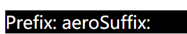
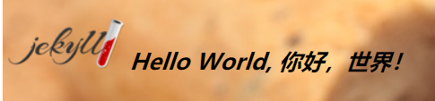
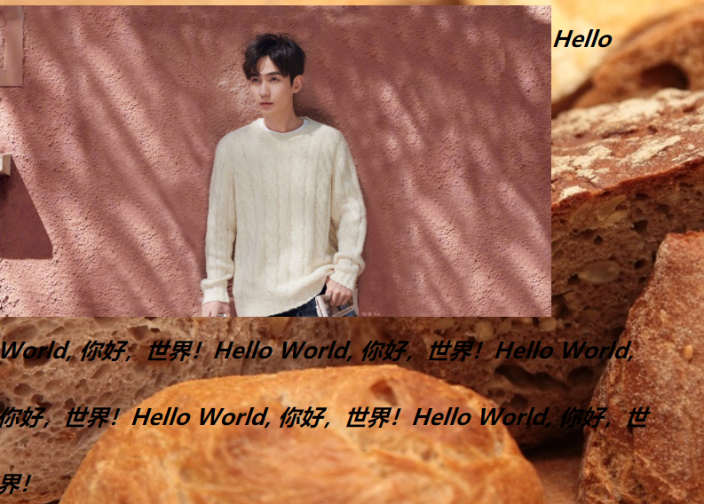
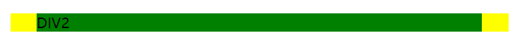
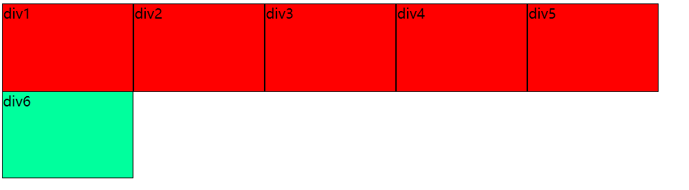
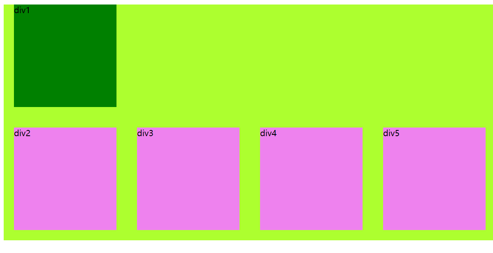
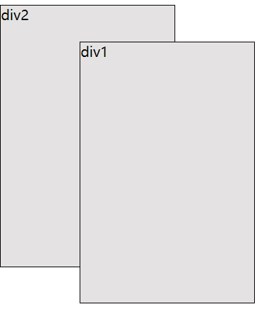
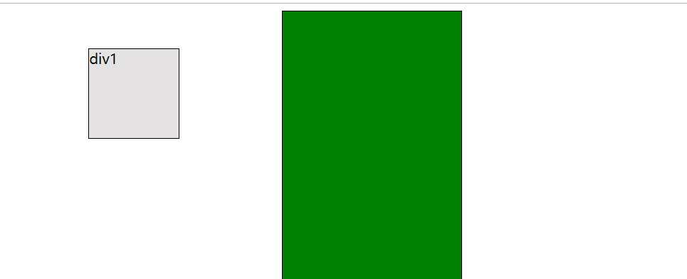
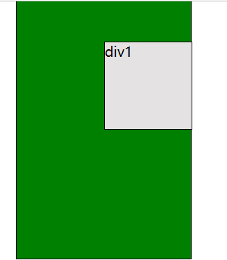

# CSS

Cascading Style Sheets，层叠样式表

## 样式的设置方法

- 内联方法，直接将样式写到标签里

  ```
  <div style="background-color: red; color: pink; width: 100px; height: 100px"></div>
  ```
- 内部样式表：写到<head>里去

  ```
  <head>
    <style>
    div {
         color: red;
         width: 100px;
         height: 100px;
         background-color: pink
    }
    </style>
  </head>
  <body>
    <div>苹果</div>
  </body>
  ```
- 外部样式表：通过<link>标签引入外部样式表

  ```
  <head>
    <link rel="stylesheet" href="example.css">
  </head>
  ```
  ## 注释

  css中注释的方法：`/*注释*/`

  ## 颜色的设置方法

  用RGB：

  ```
  color: rgb(255, 0, 0)
  ```

  或者：

  ```
  rgb(100%, 0%, 0%);
  ```

  或者可以直接用名称：`color: red`， 点击[这里](http://www.w3school.com.cn/tags/html_ref_colornames.asp)，查看颜色的名称。

  16进制的颜色写法：`color: #FFFFFF`，那么红色就可以写成`#FF0000`，代表R、G、B的两个字符一直的话，可以简写成一个，因此`#FF0000`可以写成`#F00`

## 选择器

**作用**：通过选择器可以找到HTML中的元素，并且将选择器后面的样式传递给元素。

包括4个大类：  
- 基本选择器
- 组合
- 属性
- 伪元素

### 基本选择器

- 通配符：
- 标签：`<div>`
- id选择器
- 类型选择器：`<class>` 

#### 通配符

`*` 代表所有的标签

```
* {
    border: 1px solid black;
}
```

#### 标签选择器

```
div {
    border: 1px solid black;
}
```

#### ID选择器

```
<p id="text">para</p>
```
在css中：  
```
#txt {
    font-size: 60pt
}
```
也可以写成：
```
*#txt {
    font-size: 60pt
}
```
两者是一模一样的。后面的可以结合通配符一起理解，也就是说所有id是txt的元素，都可以通用这里的定义。

当然，也可以用具体的标签去取代通配符，限定这个ID使用到的标签，比如：

```
p#txt {
    font-size: 60pt
}
```


编程的思想：id具有唯一性，相当于人的身份证。
1. 每个人有，且只有一个号码；
2. 人和人之间的号码不一样  

- css也继承了一部分ID的思想，坚持了第一条——元素只能有一个ID。  
- 但是第二点并不会坚持。ID可以在不同的元素中不断出现。但是为了契合编程思想，需要人为地进行控制，让同一个ID不要出现在两个元素。

#### `class`选择器

用`.`代表类型。比如`.txt`。

```
.txt {
    font-size: 60pt
}
```

`class`标签和`id`标签的区别，在于`class`标签不具备唯一性。所以一个标签里可以有多个`class`。

和`id`一样，`class`也省略了通配符，也可以限定标签，比如`div.myclass`

```
.txt {
    font-size: 100px;
}

.txt2 {
    color: red;
}
```
```
<p class="txt txt2">我有两个类型</p>
```

现在的主流用法是，css中尽量用`class`去取代`id`，而`id`主要用在js中。

## CS的原理

- 优先原则：后解析的内容会覆盖掉之前解析的内容。
- 继承原则：嵌套里面的标签会继承外部标签的某些样式。也可以说，子元素可以继承父元素的属性。

### 优先原则：针对选择器而言

- 同一个选择器，文件是自上而下执行的。下面的例子中，实际有效的颜色是绿色的，因为绿色在下面。
  ```
  div {
      color: red;
      color: green;
  }
  ```
- 同一类型的选择器：从上往下。
  ```
  div {
      background-color: red;
  }
  div {
      background-color: green;
  }
  ```

  或者
  ```
  .bg1 {
      background-color:blue;
  }
    .bg2 {
      background-color:green;
  }
  ```
  然后在html中，进行这样的定义：
  ```
  <div class="bg1 bg2">背景</div>
  ```
  一定会显示bg2中的定义。这是和css中定义的顺序有关的，和`class="bg1 bg2"`没有任何关系，也就是说，即使写成`class="bg2 bg1"`，仍然会显示bg2中的背景，因为bg2在css中的顺序较后。

- 不同类型的选择器，先解析低优先级的，再解析高优先级的。  
  之前学了`*`选择器、`<div>`选择器、 `class`选择器和 `id`选择器。他们的优先级是由低到高的。比如说：
  ```
  div {
      background-color: red;
  }
  .bg1 {
      background-color: green;
  }
  ```
  html中：
  ```
  <div class="bg1">div1</div>
  ```
  会先去解析低优先级的，也就是`div`，红色背景，然后解析高优先级的，也就是`class`，绿色背景。最终会显示绿色背景。  
- 外部样式和内部样式会合并一起解析。先解析外部样式，再解析内部样式。  
- 外部+内部解析完了之后，才解析内联样式。
- 加了important字段的，最后执行。
  ```
  div {
      background-color: green!important;
  }
  div {
      background-color: yellow;
      font-size: 30px;
  }
  ``` 
  永远都会显示被标注`!important`的属性，因此会使用绿色背景。

### 继承原则

- 和文本相关的样式才会被继承，其他的不会被继承。
- 块级元素的宽度如果不设置的话，那么会继承最接近的父类块级元素的宽度。高则由内容决定。

#### 组合选择器

把基本选择器通过特殊的符号串到一起，表示特定的意义，就是组合选择器。
需要掌握四点：
- 分组选择器

##### 分组选择器

- 使用逗号隔开多个选择器，比如`div,p,ul`。比如下面的样式代码：  
  ```
  div {
      background: green;
  }
  
  p {
      background: green;
      font-size: 50px;
      color: red;
  }
  ```
可以写成：  
  ```
  div,p {
      background: green;
  }
  
  p {
      font-size: 50px;
      color: red;
  }
  ```
- 嵌套选择器：把多个选择器用空格隔开，比如`div p`，表示样式生效的范围仅限于嵌套在`div`里的`p`。`div`和`p`不必是紧邻的父子元素，完全可以是祖父元素关系等。比如以下示例中的`<p>`同样会生效。
  ```
  <div>
    <ul>
      <li>我是一个列表项
        <p>我是列表项里的段落。</p>
      </li>
    </ul>
  </div>
    ```
- 子选择器：和嵌套选择器不一样，仅限于“规定父标签下的字标签”。也就是说，上面例子中的`<p>`将不会生效。
  表达方式是，这里有一个例子：`p (div)`，就是说仅对父元素是div的p标签生效。
- 相邻同级选择器：`div+p`。意思是仅对`div`同级的`p`生效。
- 属性选择器：`class`和 `id`就是属性。限定生效的范围为只有包含某个属性的标签，表达方式是`tag[properties]'，比如`p[title]，甚至可以给到具体的值，比如说`p[title=mycustom]，比如说在css中这样定义：
  ```
  p[title=qiuqiu] {
      background: pink;
      color: red;
      font-size: 48px;
  }
  ```
  那么，只有对html中是`<p>`标签，且有`title`属性，且`title`属性的值是`mycustom`的元素有效，比如：
  ```
  <p title="mycustom">aero</p>
  ```
  上面是用[属性=值]的表达方式。另外，还可以用模糊匹配来进行表达，表达方式是[属性~=值]，表示只要属性的值包含指定的值，就能生效。比如：
  ```
  p[title~=mycustom] {
    background: pink;
    color: red;
    font-size: 48px;
  }
  ```
  html中：
  ```
  <p title="mycustom abc">aero</p>
  ```
  还有表达方式表示属性值以...开始，表达方式是[属性^=值]。
  以...结束的表达方式，[属性$=值]
- 伪元素选择器。
  什么是伪元素：假的元素，相对真的元素而言。真的元素就是指手打的元素。
  在html中，每一个元素都会有两个伪元素，也就是开始: before 和结束：after。比如`<p>我是段落</p>`，其实都有没有显示出来的before和after元素，
  ```
  <p>
    <!-- <before> -->
    我是段落
    <!-- <after> -->
  </p>
  ```
  但凡是元素，就能通过css修改before的内容，通过下面示例中的修改来让`<p>`标签元素有前缀文字和后置文字：
  ```
  p::before{
    content: "Prefix: ";
  }

  p::after{
    content: "Suffix: ";
  }
  ```
  之后，html中的`<p>`标签的元素就会自动加上"Prefix: "和“Suffix: ”的前、后缀，如下所示：
  ```
  <p>我是段落</p>
  ```
  

  针对块元素，还有其他一些伪元素：
  -  第一个字母：`first-letter`

  - 第一行：`first-line`
     ```
    p::first-line{
      color: red;
      font-size: 100px;
    }
     ```
- 伪类选择器，根据状态来改变，针对一些特别的标签等来使用。比如`<a>`标签。鼠标按上去后，字会变红。这是可以头弄过伪类选择器来加以改变的。具体后面再讲。

## 和背景有关的css属性
比如：
-  `background-color`
-  `background-image: url('')`

### 背景图片


#### 平铺方式：
- repeat-x：沿x轴进行平铺
- repeat-y：沿y轴进行平铺
- no-repeat：不平铺
```
div {
    background-image: url('images/bg.jpg');
    background-repeat: no-repeat;
    height: 800px;
}
```

#### 移动位置

以左上角为原点按x、y轴进行移动
```
div {
    background-image: url('images/bg.jpg');
    background-repeat: no-repeat;
    height: 800px;
    background-position: 100px 100px;
}
```
也可以用百分比表示：
```
background-position: 50% 0%;
```
另外，还可以用`left` `center` `right`来表示x轴的位置，用`top` `center` `bottom`来表示y轴的位置。比如：
```
background-position: center center;
```

#### 背景图片保持静止状态（不随滚轮移动变化）

默认会随着滚动滚动一起滚动

```
background-attachment: fixed;
```

#### 简短的写法

- 按顺序来写background的属性：color > image > repeat > attachment > position
- 不需要设置的值，不用写进去。

下面是一个例子：
```
background: url('images/bg.jpg') repeat-y fixed;
```
如果只有一个属性，还是建议写完整的，这样看起来更直观。

## 字体相关的CSS属性

### 具体的字体

- `font-family`指定字体。
  - 先匹配使用在前面的字体，如果没有，再匹配较后的字体；
  - 中文字体名称需要用引号包围起来，英文单字字体不需要用引号。
  ```
  font-family: "站酷酷黑","微软雅黑";
  ```
  但是，更建议用英文的字体名称：
  ```
  font-family: "站酷酷黑","Microsoft YaHei";
  ```
  这是考虑到有些系统可能不支持中文。
- `font-size`指定字体大小，这个大小是指高度，而不是宽度。系统默认是`16px`。也可以用`em`作为单位，`1em`为`16px`。
  ```
  font-size: 30px;
  ```
- `font-weight`设置字体的粗细，从100~900有9个级别，也就是100、200、300...
  ```
  font-weight: 100;
  ```
  但是，一般不会用数字去表示，而会用`normal`代表普通状态，约等于400；`lighter`代表更细的状态；`bold`，加粗状态。
  ```
  font-weight: lighter;
  ```
- `font-style`指定字体的形状，有`italic`代表斜体，`normal`代表普通。
  ```
  font-style: italic;
  ```

### 简便的写法

- 顺序是：style（形状） > weight（粗细） > size（大小）/line-height（可加可不加） > font-family（字体库）  
- 使用简便的写法时，至少需要包含字体的大小
```
font: italic bold 50px "华康圆体", "Micrsoft Yahei"  
```
lineheight: 字体的行高。（font-size决定了字体的字高）
```
body {
    font: italic bold 20px "华康圆体", "Micrsoft Yahei";
    line-height: 60px;
}
```
或者，也可以写成：
```
body {
    font: italic bold 20px/60px "华康圆体", "Micrsoft Yahei";
}
```

### 字符间距

```
.txt1 {
    letter-spacing: 10px;
}
`letter-spacing`：
```


### 空格间距

比如hello world里hello和world中间的空格的间距。使用`word-spacing`。
```
.txt3 {
    word-spacing: 30px;
}
```

### 阅读方向

`ltr`表示left to right；`rtl`表示right to left。
```
direction: ltr
```
### 删除线/上划线/下划线

`text-decoration` 可以定义文字的线条，有以下几种值：
- none，默认，没有任何线条
- line-through，删除线
- overline，文字上方线条
- underline，下划线

### 对齐方式

`text-align`有以下几种值：
- center：居中
- left：左对齐，默认。
- right：右对齐
- justified：两端对齐

### 文字的缩进

使用`text-indent`：
```
text-indent: 60px;
```

### 英文大小写字母的转换

使用`text-transform`：
- 首字母大写: capitalize
- 全部字母大写: uppercase
- 全部字母小写: lowercase
```
text-transform: capitalize;
```

### 案例：只显示若干个字符，并且将未显示的字符用...表示

1. 使用`width`限制块级元素的宽度，这样文本会自动换行；
2. 使用`white-space`，禁用掉自动换行，这样文本会溢出在块级元素的外面，但是仍然会显示；
3. 使用`overflow`，设置为`hidden`，将溢出文本隐藏；
4. 使用`text-overflow`
```
    width: 200px;
    white-space: nowrap;
    overflow: hidden;
    text-overflow: ellilpsis;
```

#### `text-overflow`属性

- cilp：默认值，保持原样
- ellilpsis：将隐藏文字替换为省略号

## 图片和文字结合的相关CSS样式

下面一段代码，将``和文字都放在一个`<p>`标签里：
```
<p></p>Hello World, 你好，世界！</p>
```
出来的效果是这样的：  
  
可以看到文字默认是与图片的底部对齐的。如果要进行修改，需要用到`vertical-align`，对应的值有：
- top
- center
- bottom
- 比分比，比如100%是一个行高。

```
img {
    width: 500px;
    vertical-align: top;
}
```
上面的示例，就能让图片和文字上对齐。

### 文本环绕

文本和图片一起出现，且文本很长，图片设置为垂直对齐上对齐的情况时，就会出现除第一行外所有文字都出现在图片下方的情况，如下图所示：  
  
如果想要实现文本绕排功能，就要用到`float`属性。
```
img {
    width: 500px;
    float: left;
}
```

## 链接状态样式改变及列表样式优化

### 链接状态样式

伪类对应四种状态：
- 初始状态: `a:link`
- 被访问的状态：`a:visited`
- 鼠标悬浮的状态：`a:hover`
- 点击下去的状态：`a:active`

还能加入`font-size`等属性，让字体随着状态的变化变换大小。

### 列表样式优化

#### `<ul>`的样式优化

一般来说，我们会将`ul`的`list-style-type`样式设置为none，这样就可以摆脱系统内置的项目编号，使用自己的图片来定义列表的样式。
```
ul {
    list-style-type: none;
}
```

### `<li>`的样式优化

接着，就可以通过为`<li>`元素定义`background-image`属性来使用自定义图片了。你需要做以下几点：
1. `background-image: ('URL')`：定义使用什么样的图片；
2. `background-repeat: no-repeat;`禁用图片的循环功能；
3. `height`: 根据图片的大小调整行高；
4. `padding`：如果不设置的话，图片位置可能在文字右边，这样显然不行，所以需要适当调整图片的位置才可以。

下面是一个例子：
```
li {
    background-image: url('images/great.png');
    background-repeat: no-repeat;
    height: 50px;
    padding: 25px 50px 0;
}
```

# 盒子模型

可以将页面内所有的元素看作一个矩形的盒子。

## 盒子的组成

- 盒子的内容
- 内边距
- 盒子框
- 外边距

这里打个比方，有一堆鞋盒堆在一起，那么：
- 内容：就是鞋子；
- 内边距：鞋子放在鞋盒里，四周的空隙；
- 盒子框：鞋盒；
- 外边距：鞋盒和鞋盒之间的距离。

## 如何定义内边距`padding`

- 完整定义padding以顺时针方向定义，按上右下左的顺序进行定义
- 上下20px 左右50px padding: 20px 50px;
- 上20 左右50 下60px padding: 20px 50px 60px;
- 也可以拆分成paddig-left等去定义，不过一般倾向上面的做法。

## 如何定义外边距`margin`

和padding的方法类似，不过有一个margin重叠的问题：

- 平级的元素，上下会取两个的最大值，比如上面盒子的margin-bottom是60，下面盒子的margin-top是30，那么最终两个盒子中间的留白是60.
  1. 解法方式：用`float`解决
  2. 用inline-block来解决

### 使用`float`来解决

在css中：
```
.test1 {
    border: 1px solid black;
    margin: 30px;
    background: violet;
}

.test2 {
    margin: 60px;
    background-color: cyan;
    border: 1px solid black;
}

div {
    float: left;
    width: 800px;
}
```

### 使用`inline-block`来解决

不改变`.test1`和`.test2`，就改变`float`：
```
div {
    /*float: left;*/
    display: inline-block;
    width: 800px;
}
```

## 块级元素嵌套时`margin`显示问题的解决：
CSS:  
```
.box1 {
    margin: 30px;
    background: yellow;
    border: 1px solid black;
}

.box2 {
    margin: 30px;
    background: green;
    border: 1px solid black;
}
```
HTML:  
```
<div class="box1">
  <div class="box2">DIV2</div>
</div>
```

这样写的话，会发现并没有按照预期的想法，box2嵌在box1里面，且和box1有30px的上下左右的空白距离。


这是因为，box1、和box2的内容太少了，就变成了好像一个上下都没有封起来的盒子，那也无从谈起上下的边距了。解决方法是：
1. 为盒子设置边框
   ```
   border: 1px solid black;
   ```
2. 加上`padding`的设置
3. 用`overflow`进行裁剪。
  ```
.box1 {
      margin: 30px;
      background: yellow;
      /*border: 1px solid black;*/
      /* padding: 10px;*/
      overflow: hidden;
  }
  ```

# `float`和`clear`精讲
  
  块元素是一种会占据行的元素。那如果多个`div`标签元素在一起的话，就会出现垂直按序出现的情况。  
  想要让块元素在同一垂直位置出现，就需要用到`float`属性。这样一来，定义了`float`属性的块级元素就会像气球
  一样产生“浮动”的效果，飘到同一排中。而标准流中的块级元素就会被覆盖住。比如说：
  ```
  .div1 {
    float: left;
    background-color: red;
    width: 150px;
    height: 100px; 
}

.div2 {
    float: left;
    background-color: red;
    width: 150px;
    height: 100px; 
}

.div3 {
    float: left;
    background-color: red;
    width: 150px;
    height: 100px; 
}

.div4 {
    float: left;
    background-color: red;
    width: 150px;
    height: 100px; 
}

.div5 {
    float: left;
    background-color: red;
    width: 150px;
    height: 100px; 
}

.div6 {
    background-color: rgb(0, 255, 157);
    width: 150px;
    height: 200px; 
}
  ```

  html:
  ```
    <div class="div1">div1</div>
    <div class="div2">div2</div>
    <div class="div3">div3</div>
    <div class="div4">div4</div>
    <div class="div5">div5</div>
    <div class="div6">div6</div>
  ```
  呈现的效果：  


如果想让`div`标签元素正常全尺寸显示在定义了`float`的前5个元素的下方，就需要加入`clear`属性，清掉前面的`float`，在`.div6`的定义中加入这一行即可：
```
clear: both;
```

如果要在同一垂直高度显示5个`div`标签元素，并且需要让它们处于标准流中，应该怎么做呢？
这时候，需要用到伪元素。
作为一个块级元素，`div`的首尾也有`<-- <before> -->`和`<-- <after> -->`这两个伪元素在，之前有利用过这两个伪元素给块级元素加上前缀文字和后缀文字。这里就利用`after`来给它定义空的内容，并且给与它`clear`属性，来达成目的。
在html中，将垂直一排的`div`元素嵌套到一个`div`标签中，将它的类别设置为`container`。
```
     <div class="container">
         <div class="div1">div1</div>
         <div class="div2">div2</div>
         <div class="div3">div3</div>
         <div class="div4">div4</div>
         <div class="div5">div5</div>
     </div>
```

css中，定义`container`的`after`：
```
.container::after {
    content: "";
    display: block;
    clear: both;
}
```

需要注意的是，`after`这个伪元素是一个行内元素，所以特地写了`display: block`来将它转换成块元素。  
当然，还有一种做法是直接加一个内容为空的`div6`的标签，在它的定义中进行清float的操作，但是这样就显得不够优雅。

## `margin`的问题

在上面的例子中，如果我们将`div`标签的定义中的边框设置去掉，另外加上`margin: 20px;`的定义，会出现一个问题：



按照`div`的全局定义，父级`div`元素和子级`div1`元素应该会有`20px`的留白，但是并没有如期出现。
```
div {
    background-color: greenyellow;
    margin: 20px;
}
```

那么伪元素又需要出现了，它不但可以清浮动，还能清除掉这种margin重叠的问题。
```
.container::before {
    content: "";
    display: table;
}
```

和刚才对`after`伪元素的定义合并到一起，就可以这样写：
```
.container::after, .container::before {
    content: "";
    display: table;
}

.container::after {
    clear: both;
}
```

# 相对定位、绝对定位

`position`:  
- `static`：默认值
- `fixed`: 无论页面怎么滚动，永远固定在一个位置
- `relative`：相对父级容器位置的定位，可以类比成灵魂出窍。
- `absolute`：绝对定位。和`float`定位有点类似，也可以类比成绑气球。

这两种比喻下面会用具体的[图解](css.md#灵魂出窍和绑气球)来解释。

- 坐标定位的方式：
  - `top`:
  - `bottom`：
  - `left`:
  - `right`:    
  他们两两一组，`top`和`bottom`一组，`left`和`right`一组。比如：
  ```
    div {
      width: 200px;
      height: 300px;
      background: rgb(228, 226, 226);
      position: fixed;
      bottom: 100px;
      right: 50px;
  }
  ```

  ## 灵魂出窍和绑气球

  相对定位可以类比成灵魂出窍：  
  
    
  可以看到`<div1>`标签元素虽然做了位置上的移动，但是仍然占据了移动位置前的空间，`<div2>`元素并没有顶掉他的位置。

  再来看绝对定位的效果：  
    
  `<div1>`已无所谓身体灵魂，全部都向定义的坐标位置移动了，并且`<div2>`顶上了它的位置，就这一点来说，像不像“绑了气球”的`float`属性呢？

  ## 子级`div`标签元素的绝对定位

  需要注意的是，子集`div`标签元素有绝对定位时，它会去一层层去追溯上级的定位信息。如果上级所有标签元素都没有定位信息，就直接按照`body`去定位。因此，下面的例子中，`div1`并不会根据它的父级标签去定位，而是直接按照`body`来定位了。

示例中的css的定义：
```
  .div1 {
    width: 100px;
    height: 100px;
    position: absolute;
    top: 50px;
    left: 100px;  
}
.container {
    margin: auto;
    background: green;
}
```

示例中html：
```
    <div class="container">
        <div class="div1">div1</div>
    </div>
```



解决方法，就是在`container`中加入定位信息：
```
.container {
    margin: auto;
    background: green;
    position: relative;
}
```


